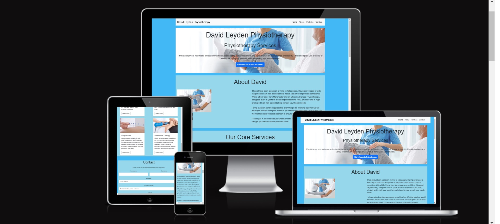
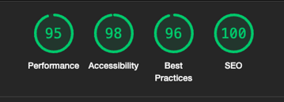

Code Institute - Milestone project 1: User-Centric Frontend Development

The website is live and can be accessed at: https://davidleyden1.github.io/MS1/

This website is designed to provide clients/prospective clients of a physiotherapy practice with information about the services provided at the practice as well as contact forms and information.

### Table of content
* [Introduction](#introduction)
* [User experience](#user-experience)
* [Design](#design)
* [Features](#features)
* [Technologies Used](#technologies-used)
* [Testing](#testing)
* [Deployment](#deployment)
* [Credits](#credits)

## Introduction
David Leyden Physiotherapy is targeted at individuals seeking physiotherapy treatment. The aim of this website is to provide information about the lead physiotherapist, the services provided. Another aim of the website is to allow people to get in touch via a form that could in time be linked to a booking system.

## User experience
### User story

* Goals for a first time visitor
  * I want to know about the background of the physiotherapist
  * I want to know what services are provided
  * I want to know if the problem I am having is covered
  * I want to know if this is a professional, experienced service
  * I want to be able to contact the clinic and move towards arranging an appointment

* Goals for a returning visitor 
  * I want to remind myself of the physiotherapists skills/services provided
  * I want to re-familiarise myself with the clinic
  * I want to check contact details to contact the clinic

* Goals for a frequent visitor  
  * I want a quick overview to make sure nothing has changed with the service and to be abreast of new services offered. 

* The website owner's goals
  * I want to attract new clients
  * I want to inform clients of services provided.
  * I want to ensure clients can contact me and make steps towards booking
  * I want to get across that this is professional clinic
  * I want to ensure customers can access our online presence

## Design
The design of the website is divided into three separate areas for easy navigation. The upper section is the About section, which details professional qualifications and what clients can expect from the service. The second section is a portfolio section which highlights some of the main treatments provided. This helps clients to better understand services offered and what they entail. The third and final section is a form section which allows clients to contact the clinic as a step towards arranging appointments.

### Wireframes
The layout of the website was initially sketched on a piece of paper. 

### Fonts and colour theme
The font that was chosen was Montserrat, with Serif as a backup.

The image at the top of the home page was selected first. By using [Colorpicker](https://imagecolorpicker.com/en) a color palette was created based on the colors in the image.
 
 
 
 From the color palette, four colors was chosen as a color theme.

 1. Light Blue    #96d7eb
 2. Light Grey    #D3D3D3
 

 ### Images
 All images are downloaded from [Freepik](https://www.freepik.com/). The images were selected to match the content of the website and images with similar colour profiles were chosen to help with website cohesion. 

 ### Text
 The text in the portfolio section was written by the author.

 ## Features
 ### Navigation bar

The navigation bar is located at the top of every page. In the navigation bar, you can find links to the sections ***Home, About*** and the ***Contact*** form. On the left - hand side, there David Leyden Physiotherapy text that forms a heading for the webpage. On devices with a width of 575px or less, the menu is changed to a hamburger dropdown menu.

### Footer
In the footer there are social media icons. By clicking on the icons the visitor is being linked to  *Facebook, Twitter, or *Email*. The links open in a new tab.

### Form
By clicking on the button ***Contact Us*** in the navigation bar, visitors access a form. To submit the form, *Email, contact number*, and *service requested* *additional information* need to be filled in correctly.

### Future features
Some ideas about the future:
*  to provide a link to directly book appointments
*  to add a section with past customer reviews.
*  to provide a section outlining prices
*  to add a blog section to the website

## Technologies Used
### Languages
*  HTML
*  CSS

### Frameworks & Tools
* [Am I responsive?](https://ui.dev/amiresponsive) 
* [Bootstrap v5.3](https://getbootstrap.com/)
* [Colorpicker](https://imagecolorpicker.com/)
* [Font Awesome](https://fontawesome.com/)
* [Freepik](https://www.freepik.com/)
* [GitHub](https://github.com/)
* [Google Fonts](https://fonts.google.com/)
* [Visual Studio Code](https://code.visualstudio.com/)

## Testing
### Validation
* [Web Accessability evaluation tool](https://wave.webaim.org) has been used frequently throughout the project. Syntax errors have been identified and resolved. Before submission, no errors were found.
)
.png)
* [CSS Validator](https://jigsaw.w3.org/css-validator/) has also frequently been used. Every identified error was corrected prior to submission.
.png)
* Lighthouse testing show good results for speed, accessibility, and SEO.

 
### Responsiveness
The website has been tested on several devices, mobiles, tablets and laptops. It responds as expected on all tested screen sizes. The same applies to different browsers such as Chrome, Microsoft Edge and Safari. 

### Manual testing
The Join Us form and all links on all the pages have been tested. The results were satisfactory. More details are shown in the table below.

| What's being tested   | Expected outcome |Actual outcome
| -------- | ------- |-------|
| **Navigation bar**  |   |
| David Leyden Physiotherapy | By clicking the name in the top left corner the visitor will return to the top of the home page  |Works as expected
| Home   | By clicking **Home** in the navigation bar, the visitor will return to the top of the home page   |Works as expected
| About | By clicking on **About** the visitor will get to the section of the page detailing the therapists qualifications and skills provided. |Works as expected
| Portfolio | By clicking **Portfolio** the visitors move towards a section of the page detailing treatments provided |Works as expected
|   |   |   |
| **Footer** |     |    |
| Facebook | By clicking the Facebook icon, David Leyden Physiotherapy facebook page opens up in a new tab |Works as expected|
| Instagram | By clicking the Instagram icon  Leyden Physiotherapy twitter page opens up in a new tab |Works as expected |
| Email | By clicking the Email icon, David Leyden Physiotherapy email details opens up in a new tab |Works as expected |

### Bugs
Bugs within the modal were discovered as an old version of bootstrap was used to upload a modal which resulted in error. When this was discovered a new version of the form was used to good effect.
An inline style was used to try and alter the appearance of a header however this led to bugs which were addressed by using external CSS to enact the stye changes. 

### Unfixed bugs
All identified bugs were resolved.

## Deployment

### Version Control
The website was created using VS Code and pushed to GitHub to the remote repository. Throughout the project the following git commands were used,
* **Git add .** *-Adds a change in the working directory to the staging area.*
* **Git commit -m "message"** *-Commits changes to the local repository.*
* **Git push** *-Uploads the commited changes to the remote repository in Github.*

### Deployment to GitHub Pages
1. Go to the **Settings** tab of your GitHub repo.
2. On the left-hand sidebar, in the Code and automation section, select **Pages**.
3. Make sure:
   * Source is set to 'Deploy from Branch'.
   * Main branch is selected.
   * Folder is set to / (root).
4. Under Branch, click **Save**.
5. Go back to the Code tab. Wait a few minutes for the build to finish and refresh your repo.
6. On the right-hand side, in the Environments section, click on **'github-pages'**.
7. Click **View deployment** to see the live site.

The link to the live website: [David Leyden Physiotherapy](https://davidleyden1.github.io/MS1/)

### How to clone the repository
1. From the list of repositories, click the repository you want to clone. 
2. Click the green button **Code**.
3. Choose **HTTPS** followed by **Open with GitHub Desktop**.
4. Click **Choose** and navigate to a local directory where you want to clone the repository.
5. Click **Clone**

### How to fork the repository
1. From the list of repositories, click the repository you want to fork.
2. Click on the **Fork** button in upper right hand corner.

## Credits
### Code
All code is inspired by various lessons and modules in Code Institute's LMS (Learning Management System). 
### Content
The font family is from [Google Fonts](https://fonts.google.com/).

The icons in the footer were taken from [Font Awesome](https://fontawesome.com/).

The instructions under [Deployment](#deployment) were taken from the module *Love running -Essentials Project* and [GitHub Docs](https://docs.github.com/en/desktop/adding-and-cloning-repositories/cloning-a-repository-from-github-to-github-desktop). 

### Media
The images of the project on different devices, are created using a website called [Are you responsive?](https://ui.dev/amiresponsive)

The rest of the images are all downloaded from [Freepik](https://www.freepik.com/).

### Acknowledgements
A special thank you to my mentor for his invaluable advice, guidance and support. I also want to thank a friend (Alex) for helping me navigate through aspects of using Github Codespace, reviewing work and providing some fantastic feedback. I would like to thank my family for supporting me through some of the challenges encountered during this project. 